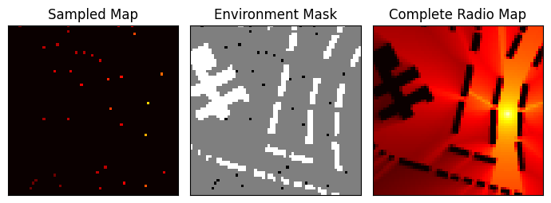
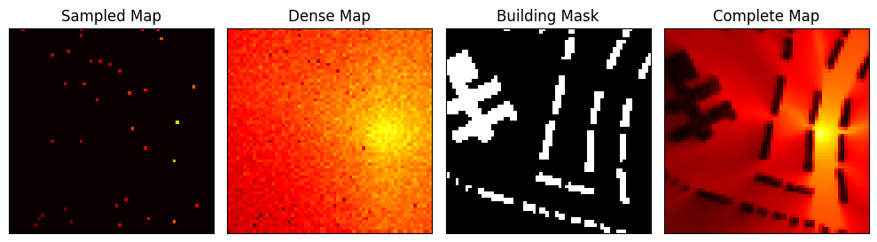

# Two-Stage Radio Map Estimation

This repository builds on previous work in radio map estimation (RME), predicting radio power across a two-dimensional area. As in previous experiments, we don't have knowledge of transmitter location(s), and the environment contains buildings which block and reflect radio signals. We take as input a small number of radio power measurements and a mask showing the locations of these sampled measurements and the buildings in the environment. The model then outputs a complete radio map showing predicted radio power at all locations on the 2D area (optionally with or without predictions at building locations, which should be 0 for radio powers normalized between 0 and 1 or the lowest unnormalized radio power representing the noise floor).

*Sample Input and Output: Sampled Map and Environment Mask are fed as input to the model, which outputs Complete Map. Maps are adapted from RadioMapSeer Dataset, discussed below.*

The idea behind two-stage radio map estimation is to split the task of RME into two parts: first, taking the sparsely sampled measurements and predicting a dense radio map *without reference to buildings*, i.e. as if the radio signal were propagating across an empty field; second, taking this dense radio map prediction and convolving it with a map of building locations ("building mask") to produce a more accurate radio map that takes the physical environment into account.

