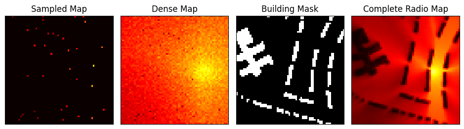

# Two-Stage Radio Map Estimation

This repository builds on [previous work](https://github.com/GeoAICenter/radio-map-estimation-pimrc2023) in radio map estimation (RME), predicting radio power across a two-dimensional area. As in previous experiments, we don't have knowledge of transmitter location(s), and the environment contains buildings which block and reflect radio signals. We take as input a small number of radio power measurements and a mask showing the locations of these sampled measurements and the buildings in the environment. The model then outputs a complete radio map showing predicted radio power at all locations in the 2D area (optionally including predictions at building locations).

*Sample Input and Output: Sampled Map and Environment Mask are fed as input to the model, which outputs Complete Radio Map. Input and ground truth maps are adapted from the RadioMapSeer Dataset, discussed below.*

The idea of two-stage radio map estimation is to split the task of RME into two parts: first, taking the sparsely sampled measurements and predicting a dense radio map *without reference to buildings*, as if the signal were propagating through empty space; second, taking this dense radio map prediction and convolving it with a map of building locations ("Building Mask") to produce a more accurate radio map that takes the physical environment into account.

*Sample Input and Output of Two-Stage RME: Instead of jumping straight from the sampled map to the complete radio map with buildings, an intermediate map is produced ("Dense Map") that ignores buildings and just extrapolates from sample strength and location.*

The intuition behind this is that radio propagation has unique physical characteristics, in particular a source of propagation (i.e. a transmitter) and a relationship between signal strength and distance from that source, that most image data don't have. A model that can learn these physical characteristics would presumably perform better than one that treats the radio map like a normal image. 